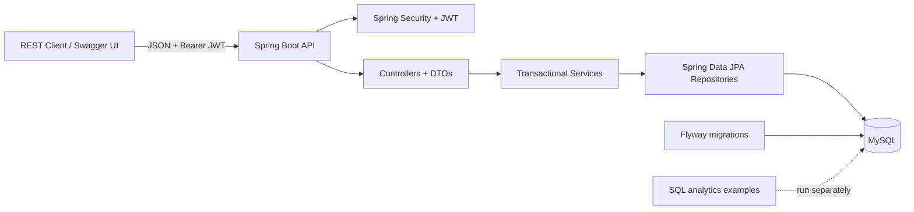

# QuickBite

## Overview

QuickBite is a Java 21 / Spring Boot REST API foundation for a food-delivery application. It models customers, restaurant owners, restaurants, menus, carts, orders, and delivery addresses using MySQL and Flyway. The API returns DTOs rather than JPA entities and uses stateless JWT bearer authentication for protected routes.

## Features

- Customer registration and JWT login with BCrypt password hashing.
- Role-aware authorization for `CUSTOMER`, `RESTAURANT_OWNER`, and `ADMIN`.
- Pageable restaurant, menu, order, and admin listings with search/filter parameters.
- Ownership checks for restaurant, menu, cart, order, and address operations.
- Transactional order creation with availability/quantity checks, price snapshots, fee calculation, and cart clearing.
- Flyway-controlled schema; Hibernate schema mode is `validate`.
- Bean Validation and a structured JSON error envelope.
- OpenAPI/Swagger UI metadata and a documented HTTP bearer scheme.
- 18 MySQL analytics query examples in [`analytics.sql`](src/main/resources/sql/analytics.sql).

## Tech Stack

- Java 21
- Spring Boot 3.5.6, Spring Web, Spring Data JPA, Spring Security
- MySQL 8.4, Flyway
- JJWT 0.12.6
- Jakarta Bean Validation
- springdoc-openapi 2.8.13
- JUnit 5, Mockito, AssertJ
- Docker and Docker Compose

## Architecture



Controllers handle HTTP input/output and delegate to services. Services own business rules and transactional workflows. Repositories provide persistence and pageable queries. Entity relationships are lazy by default; DTO mapping and targeted entity graphs keep persistence objects out of API responses.

## Project Structure

```text
src/main/java/com/quickbite/api/
  api/             REST controllers, actor resolution, request/response DTOs
  config/          pagination and OpenAPI configuration
  entity/          JPA entities and persisted enums
  exception/       domain exceptions and global error mapping
  repository/      Spring Data repositories and projections
  security/        JWT, bearer filter, Spring Security, bootstrap admin
  service/         business workflows and command records
src/main/resources/
  application.yml
  db/migration/    versioned Flyway schema
  sql/             analytical SQL examples
src/test/java/     focused JUnit/Mockito tests
```

## Database Design

The initial Flyway migration creates `users`, `restaurants`, `menu_items`, `carts`, `cart_items`, `orders`, `order_items`, and `addresses`. It includes foreign keys, uniqueness/check constraints, audit timestamps, indexes for common ownership/catalog/order filters, and string-valued role/status columns.

`order_items` stores item-name and unit-price snapshots so historical order lines do not change when a menu entry is edited. See [`docs/data-model.md`](docs/data-model.md) for normalization, index choices, joins, transaction/ACID notes, and an `EXPLAIN` example. Hibernate is configured with `ddl-auto: validate`; schema changes belong in new Flyway migrations.

## API Documentation

When the application is running:

- Swagger UI: `http://localhost:8080/swagger-ui/index.html`
- OpenAPI JSON: `http://localhost:8080/v3/api-docs`

The OpenAPI configuration describes HTTP bearer JWT authentication. Protected requests use `Authorization: Bearer <access-token>`.

## Endpoints

| Method | Path | Access / purpose |
| ------ | ---- | ---------------- |
| `POST` | `/api/auth/register` | Public customer registration |
| `POST` | `/api/auth/login` | Public login; returns a JWT access token |
| `GET` | `/api/users/me` | Current authenticated user |
| `PUT` | `/api/users/me` | Update own profile |
| `GET` | `/api/restaurants` | Public paginated search (`cuisine`, `minimumRating`, `search`) |
| `GET` | `/api/restaurants/{id}` | Public active restaurant detail |
| `POST` | `/api/restaurants` | Restaurant owner/admin creates a restaurant |
| `PUT` | `/api/restaurants/{id}` | Owner/admin updates an owned restaurant |
| `DELETE` | `/api/restaurants/{id}` | Owner/admin deactivates an owned restaurant |
| `GET` | `/api/restaurants/{restaurantId}/menu` | Public paginated menu (`search`, `category`, `available`) |
| `POST` | `/api/restaurants/{restaurantId}/menu` | Owner/admin adds a menu item |
| `PUT` | `/api/menu-items/{id}` | Owner/admin updates an owned menu item |
| `DELETE` | `/api/menu-items/{id}` | Owner/admin marks an owned menu item unavailable |
| `GET` | `/api/cart` | Customer reads or initializes own cart |
| `POST` | `/api/cart/items` | Customer adds a menu item |
| `PUT` | `/api/cart/items/{itemId}` | Customer changes own cart quantity |
| `DELETE` | `/api/cart/items/{itemId}` | Customer removes own cart item |
| `POST` | `/api/orders` | Customer places an order from own cart |
| `GET` | `/api/orders` | Authenticated paginated orders (`status`, date range; owner also specifies `restaurantId`) |
| `GET` | `/api/orders/{id}` | Customer, owning restaurant owner, or admin reads order |
| `PATCH` | `/api/orders/{id}/status` | Owning restaurant owner/admin advances order status |
| `POST` | `/api/orders/{id}/cancel` | Customer cancels own newly placed order; admin may cancel |
| `GET` | `/api/addresses` | Customer lists own addresses |
| `POST` | `/api/addresses` | Customer creates address |
| `PUT` | `/api/addresses/{id}` | Customer updates own address |
| `DELETE` | `/api/addresses/{id}` | Customer deletes own address unless referenced by an order |
| `GET` | `/api/admin/users` | Admin lists/searches users |
| `PATCH` | `/api/admin/users/{id}/restaurant-owner` | Admin grants/removes restaurant-owner access |
| `GET` | `/api/admin/restaurants` | Admin lists restaurants |
| `GET` | `/api/admin/orders` | Admin filters orders by status/date |
| `GET` | `/api/admin/statistics` | Admin reads counts and non-cancelled order revenue |

Pagination uses Spring Data `page`, `size`, and `sort`; requested page size is capped at 100. Restaurant ratings are currently a filterable persisted field; no customer review/rating submission workflow is implemented.

## Authentication

Registration creates `CUSTOMER` accounts only. Passwords are BCrypt-hashed. Restaurant-owner access is granted by an administrator through the role endpoint; admin accounts can be provisioned with `BOOTSTRAP_ADMIN_EMAIL` and `BOOTSTRAP_ADMIN_PASSWORD`. No role is accepted from the public registration body.

JWT signing uses an environment-supplied Base64 key that must decode to at least 32 bytes. Access-token lifetime defaults to 15 minutes and is configurable. No secret or default admin credential is checked into this repository.

## Environment Variables

| Variable | Purpose |
| -------- | ------- |
| `DB_URL` | JDBC URL; local default targets `localhost:3306/quickbite` |
| `DB_USERNAME`, `DB_PASSWORD` | Application database account |
| `MYSQL_ROOT_PASSWORD` | MySQL root password for Compose initialization |
| `SERVER_PORT` | Local server/host port (default `8080`) |
| `DELIVERY_FEE` | Non-negative order delivery fee (default `2.50`) |
| `JWT_SECRET` | Required Base64 secret decoding to at least 256 bits |
| `JWT_ACCESS_TOKEN_TTL_MS` | Access-token lifetime in milliseconds (default `900000`) |
| `BOOTSTRAP_ADMIN_EMAIL`, `BOOTSTRAP_ADMIN_PASSWORD` | Optional paired admin bootstrap settings |

## Local Setup

Prerequisites: JDK 21, Maven 3.10.x, and a reachable MySQL 8 database. Create a `quickbite` schema and an application user, then set `DB_URL`, `DB_USERNAME`, and `DB_PASSWORD`. Generate a signing key with `openssl rand -base64 32` and export it as `JWT_SECRET`.

```sh
mvn clean test
mvn clean package
mvn spring-boot:run
```

Flyway applies the initial migration at startup, then Hibernate validates the schema. To provision an initial administrator, set both bootstrap admin variables before the first run. The bootstrap password must be 12-72 characters and no more than 72 UTF-8 bytes.

## Docker Setup

```sh
cp .env.example .env
```

Edit `.env`: replace the DB/root password placeholders, and set `JWT_SECRET` to the output of `openssl rand -base64 32`. Then run:

```sh
docker compose up --build
```

Compose waits for MySQL's healthcheck before starting the API. Persistent database files are held in the `quickbite-mysql-data` volume. The app container runs as a non-root user. The local Docker daemon/database were unavailable during this implementation session, so container startup and live Flyway application have not been claimed as verified.

## Running Tests

```sh
mvn clean test
```

Tests use JUnit 5, Mockito, and AssertJ and cover JWT signing/validation, request validation, structured error mapping, registration/password hashing, role/ownership checks, cart rules/subtotals, order totals/cancellation, address ownership/default behavior, and OpenAPI metadata. They are unit/contract tests; database-backed integration tests have not yet been run because there is no accessible MySQL account or active Docker daemon in the current environment.

## SQL Analytics

[`src/main/resources/sql/analytics.sql`](src/main/resources/sql/analytics.sql) contains 18 commented MySQL examples: restaurant ratings, top-selling items, revenue by restaurant/month, order counts by customer/day, high-order customers, restaurants without orders, cuisine popularity, average order value, cancellation percentage, highest spenders, above-average revenue, never-ordered menu entries, monthly performance, price ranges, customer order history, and trailing-period revenue. Bind the named example parameters in the consuming SQL client/application.

## Design Decisions

- Use Flyway migrations and Hibernate validation so production schema changes are explicit.
- Persist enum names as strings for readable status/role values.
- Use `BigDecimal` for prices and totals; snapshot order-line prices/names.
- Keep order placement atomic and reject mixed-restaurant carts.
- Deactivate restaurants/menu items instead of deleting records referenced by history.
- Use role checks and per-resource owner checks; public registration cannot assign privileged roles.
- Use DTOs and explicit fetch graphs rather than serializing lazy entity relationships.
- Require external JWT secrets and avoid committed credentials.

## Future Improvements

- Add database-backed integration tests and execute the migration against MySQL in CI.
- Add review creation/aggregation and a defined rating moderation policy.
- Add idempotency keys, payment integration, delivery tracking, and audit history.
- Add refresh-token/revocation strategy, rate limiting, and account recovery.
- Add restaurant opening hours, delivery zones, and address geocoding.
- Add CI checks for formatting, dependency vulnerabilities, and container image scanning.
